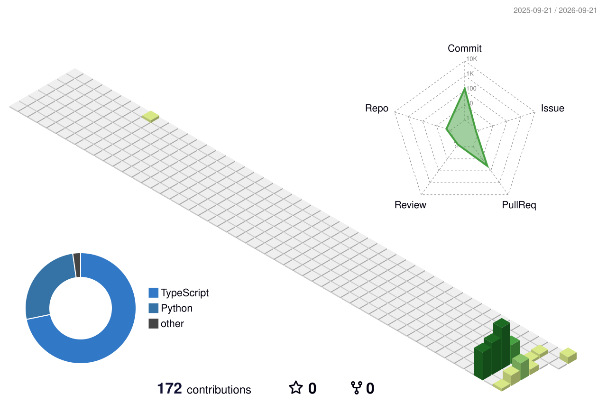

# 👋 Hi, I'm Abdelrahman Hegab

**Senior Software Engineer • Full-Stack .NET • Technical Leadership**

📍 Cairo, Egypt  
🌍 Open to Remote & Relocation Opportunities  
⚡ Available to Join Immediately

 

---

## 👨‍💻 About Me

I'm a **Senior Software Engineer with 10+ years of experience** designing, building, modernizing, and supporting enterprise and SaaS applications.

My main expertise is in the **.NET ecosystem and Angular**, with experience spanning:

- Backend & full-stack development
- Software architecture
- REST APIs & Microservices
- Enterprise integrations
- Database design & optimization
- CI/CD & deployment
- Production troubleshooting
- Code reviews & mentoring
- Technical planning & engineering standards

I've worked on enterprise products and digital platforms serving organizations across **Egypt, Saudi Arabia, and the United States**.

I spent nearly **five years working with a US-based engineering team on Upland Software's FileBound platform**, contributing to a large enterprise document management and workflow automation product.

---

## 🛠️ Tech Stack

### Core Technologies

### Data & Infrastructure

### Development

 

### Backend

`C#` • `.NET` • `ASP.NET Core` • `Web API` • `Entity Framework Core`  
`LINQ` • `SQL Server` • `PostgreSQL` • `Redis`

### Frontend

`Angular` • `TypeScript` • `RxJS` • `NgRx` • `Vue.js`

### Architecture

`Clean Architecture` • `CQRS` • `SOLID` • `Design Patterns`  
`Microservices` • `API Design` • `Distributed Systems`

### DevOps & Delivery

`Azure DevOps` • `GitHub Actions` • `CI/CD` • `Docker`  
`Kubernetes` • `Build & Release Pipelines` • `Production Deployment`

### Testing

`xUnit` • `NUnit` • `MSTest` • `Integration Testing` • `Jasmine / Karma`

---

## 🤖 AI-Assisted Software Engineering

I actively use modern AI development tools and **agentic engineering workflows** throughout the software development lifecycle.

I use AI for:

- Requirements analysis
- Technical planning
- Architecture exploration
- Repository analysis
- Implementation
- Debugging
- Refactoring
- Test generation
- Code reviews
- Documentation
- Development automation
- Multi-agent engineering workflows

> AI accelerates my engineering workflow, while architecture, validation, security, engineering judgment, and final technical decisions remain developer-owned.

---

## 💼 Experience Highlights

### 🇺🇸 Upland Software — FileBound

Nearly **five years working remotely with a US-based engineering team** on FileBound, an enterprise document management and workflow automation platform.

Worked across:

- Enterprise .NET development
- Backend APIs
- SQL Server
- Workflow & business-process features
- Performance improvements
- Refactoring
- Complex debugging
- Testing
- Production support
- Distributed team collaboration

---

### 🇸🇦 Government & Enterprise Platforms

Contributed to software platforms for organizations including:

- **Ministry of Justice — Saudi Arabia**
- **Saudi Conventions & Exhibitions General Authority (SCEGA)**
- **Good Times KSA**

Responsibilities included hands-on development alongside:

- Architecture discussions
- Code reviews
- Technical leadership
- Developer mentoring
- Engineering best practices

---

### 🇪🇬 Enterprise Solutions

Worked on enterprise solutions serving organizations including:

**Total • Mobil • Sanofi • Fit & Fix • HCWW**

Across domains such as:

`Sales & Distribution` • `ERP` • `POS` • `HR`  
`Reporting & Analytics` • `Medical Services` • `Web & Mobile Applications`

> Most of my professional work is proprietary or government-related and cannot be published publicly.  
> My public repositories focus on personal projects, architecture, developer tooling, experiments, and AI-assisted engineering.

---

## 🚀 Current Engineering Focus

- Advanced .NET architecture
- Microservices & distributed systems
- Reusable SaaS infrastructure
- Private NuGet & npm platform packages
- Modern Angular architecture
- Docker & Kubernetes
- CI/CD & deployment automation
- AI-assisted software engineering
- Agentic development workflows
- Multi-agent engineering orchestration

---

## 📊 GitHub Activity

---

## 🌌 3D Contribution Graph

---

## 🐍 Contribution Snake

<picture>
  <source
    media="(prefers-color-scheme: dark)"
    srcset="./assets/github-snake-dark.svg"
  />
  <source
    media="(prefers-color-scheme: light)"
    srcset="./assets/github-snake.svg"
  />
  
</picture>

---

## 🤝 Open to Opportunities

I'm currently interested in opportunities as a:

- **Senior Software Engineer**
- **Senior .NET Developer**
- **Senior Full Stack .NET Developer**
- **Technical Lead / .NET Technical Lead**

🌍 Open to:

`Remote` • `Egypt` • `UAE` • `Saudi Arabia` • `Qatar` • `Jordan` • `GCC / Middle East`

⚡ **Available to join immediately**

---

## 📫 Let's Connect

### 🌐 [Portfolio](https://abdelrahman-hegab.pages.dev/)

### 💼 [LinkedIn](https://linkedin.com/in/abdelrahman-nasser)

### 📧 [abdelrahman.n.hegab@gmail.com](mailto:abdelrahman.n.hegab@gmail.com)

 

**Building scalable software. Improving engineering systems. Exploring what's next with AI.**

